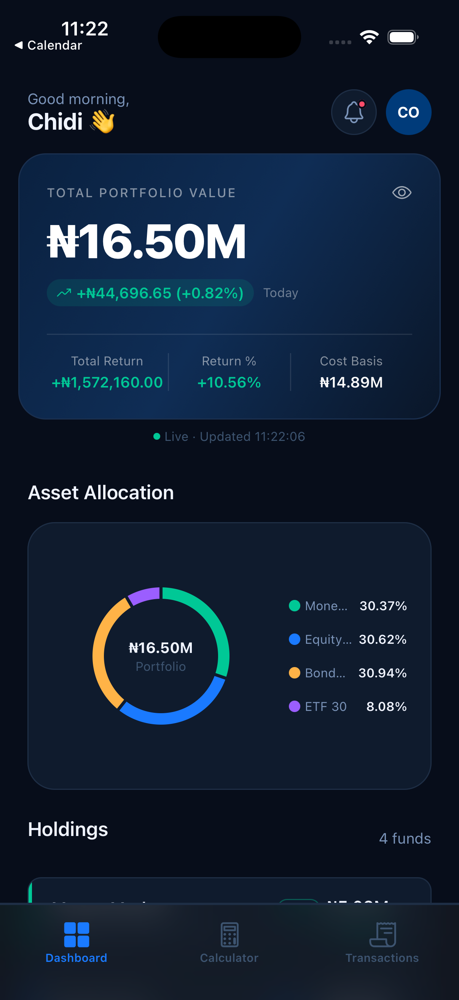
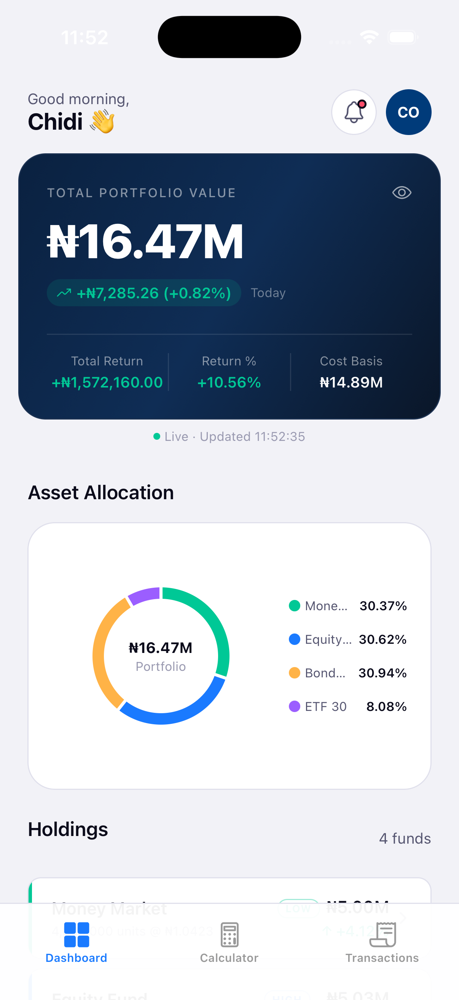
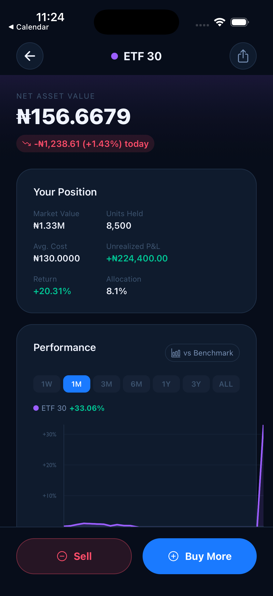
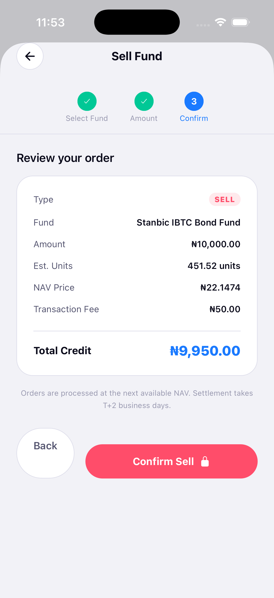
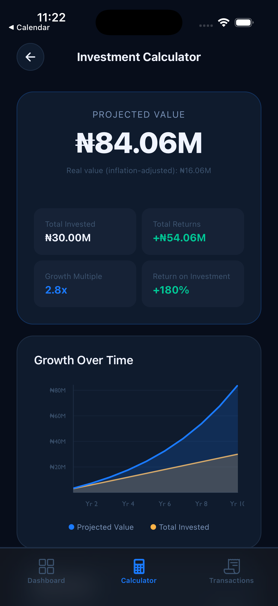
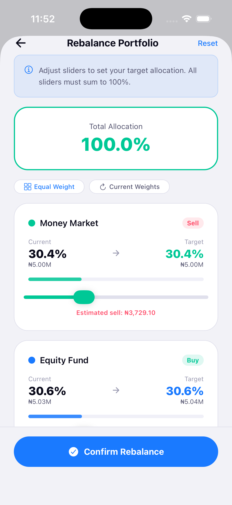

## Investment Portfolio App

A cross-platform mobile investment portfolio dashboard built with React Native and TypeScript, simulating an asset management experience for Stanbic IBTC's retail investors.

<p align="center">
  
</p>

---

## Features

- **Real-time Portfolio Dashboard** — Live NAV price simulation with WebSocket-style updates, total portfolio value, daily P&L, and return metrics
- **Asset Allocation Chart** — Interactive pie chart with tap-to-highlight fund breakdown
- **Fund Detail Screen** — Individual fund performance charts with time range selector (1W–ALL) and benchmark comparison vs NSE All-Share Index
- **Buy / Sell Trading Flow** — 3-step order flow with fund selection, amount input, fee estimation, and order confirmation
- **Portfolio Rebalancing** — Slider-based allocation wizard with real-time validation enforcing 100% constraint
- **Investment Calculator** — Compound interest projections with growth charts, milestone breakdowns, and inflation-adjusted values
- **Transaction History** — Filterable, month-grouped transaction log
- **Biometric Authentication** — Face ID / Touch ID via expo-local-authentication with simulator fallback
- **Dark / Light Mode** — Full system-wide theme switching via Redux state

---

## Tech Stack

| Layer | Technology |
|---|---|
| Framework | React Native + Expo |
| Language | TypeScript |
| State Management | Redux Toolkit |

---

## Getting Started

### Prerequisites

- Node.js 18+
- Expo CLI
- Xcode (for iOS Simulator on Mac)

### Install

```bash
git clone https://github.com/Tae5567/Investment-Portfolio-Mobile
cd Investment-Portfolio-Mobile
npm install
```

### Run

```bash
npx expo start --clear

# Press 'i' to open iOS Simulator
# Press 'a' for Android emulator
# Scan QR code with Expo Go on a real device
```

---

## Architecture Notes

- **Mock data layer** in `src/services/mockData.ts` is structured to mirror a real REST API — replacing `buildPortfolio()` and `getChartData()` with `React Query` fetch calls is the only change needed for a live backend
- **Real-time prices** are simulated via `setInterval` dispatching Redux actions, paused when the app goes to background via `AppState` listener
- **Theme system** uses a pure `getTheme(isDarkMode)` function (not a hook) to avoid Rules of Hooks violations when used inside nested components

---

## Screenshots

| Dashboard (Dark) | Dashboard (Light) | Fund Detail |
|---|---|---|
|  |  |  |

| Buy Flow | Investment Calculator | Rebalance |
|---|---|---|
|  |  |  |

---

## Disclaimer

This is a portfolio demonstration project. All data is simulated. Not affiliated with or endorsed by Stanbic IBTC Asset Management.